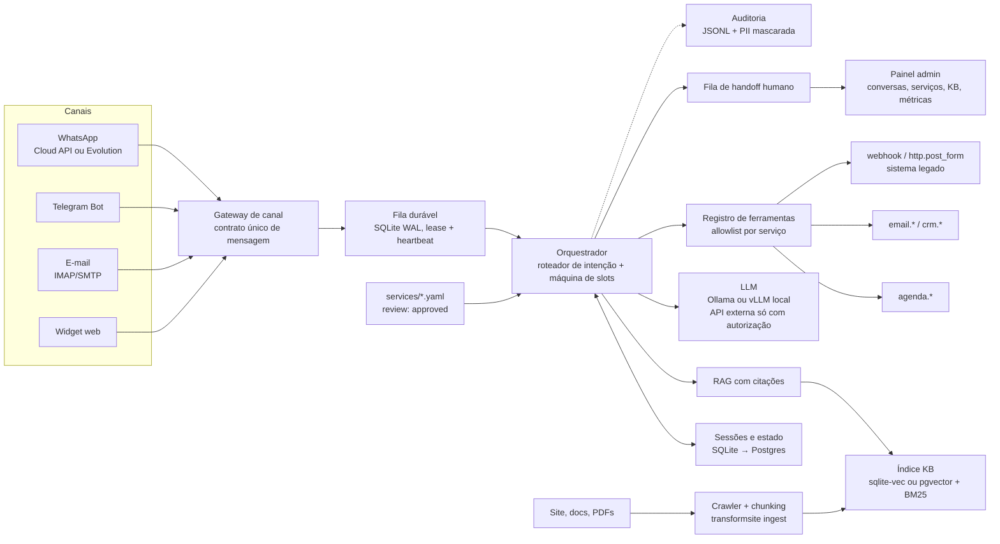

# transformsite — Plano do framework "site vira repositório, chat vira o canal"

Data: 2026-10-02 · Status: PLANO (nada implementado) · Pasta: `~/projetos/transformsite`

---

## 1. Visão e tese

**Tese:** o site da empresa deixa de ser "o lugar onde o cliente faz coisas" e passa a ser **só a fonte de verdade** (informação, regras, formulários legados). Toda interação migra para **um único canal de conversa** (WhatsApp, Telegram ou e-mail) atendido por um agente que (a) responde **somente com base na base de conhecimento, citando a fonte**, (b) executa **serviços declarados** (agendar, 2ª via, fale conosco…) coletando os dados por conversa em vez de formulário, e (c) **encaminha para humano** quando não sabe ou quando o serviço exige. O framework é a parte reutilizável: ingestão do site, motor de conversa com máquina de slots, registro de ferramentas, adaptadores de canal e um **conversor** que lê formulários legados e gera a descrição declarativa do serviço.

### Antes / depois

| Antes (formulário legado) | Depois (conversa) |
|---|---|
| Cliente procura a página certa entre dezenas | Cliente manda "quero agendar uma visita" no WhatsApp |
| 12 campos, todos de uma vez, validação só no submit | Bot pergunta 1 coisa por vez, só o que falta, valida na hora |
| Erro → recomeça; abandono alto | Correção em linguagem natural ("não, o telefone é 51…") |
| Dúvida no meio → sai do fluxo, abre FAQ | Dúvida no meio → bot responde com citação e volta ao fluxo |
| Resultado = e-mail genérico "recebemos sua solicitação" | Confirmação explícita + protocolo + ação real (evento criado, PDF enviado) |
| Nenhuma métrica além de "submits" | Taxa de resolução, tempo até concluir, pontos de abandono por slot |
| Site = app + conteúdo (duas coisas pra manter) | Site = conteúdo; o app é o chat; o site é re-indexado automaticamente |

---

## 2. Referência citada pelo usuário: America.gov (verificada)

**Correção importante da premissa:** o usuário escreveu "migrou 29 mil sistemas para um chat". O verificado é diferente e mais útil como modelo: **America.gov** (lançado em 29/09/2026) é um **chat único que responde perguntas com base no conteúdo de ~29 mil sites federais**. Ele **não migrou 29 mil sistemas**: na data do lançamento ele só responde e direciona; a conclusão de transações (renovar passaporte, inscrever no Medicare) está prometida para "ainda este ano" (fact sheet) / começo de 2027 (imprensa). Ou seja: **fase 1 = perguntas e respostas com fonte oficial; fase 2 = identidade + transações**. Exatamente o corte que este plano adota.

### O que foi verificado (fontes lidas na íntegra)

| Fato | Fonte |
|---|---|
| Lançamento em 29/09/2026 e ordem executiva *"Streamlining Access to Government Services Through America.gov"* no mesmo dia | [Ordem executiva (WH)](https://www.whitehouse.gov/presidential-actions/2026/09/streamlining-access-to-government-services-through-america-gov/) |
| "Ponto único de entrada… comunicar em linguagem simples, receber respostas precisas e, onde autorizado e tecnicamente disponível, completar transações" | Ordem executiva, Sec. 1 |
| Hoje: perguntas e respostas; "ainda este ano": passaporte e Medicare; mais serviços conforme agências integram | [Fact sheet (WH)](https://www.whitehouse.gov/fact-sheets/2026/09/fact-sheet-president-donald-j-trump-streamlines-access-to-government-services-through-america-gov/) |
| **"Serviço coberto"** = serviço público online com **>100 mil usuários em 12 meses** (regra de priorização); IRS e serviços de segurança nacional excluídos | Fact sheet (WH) |
| Política (Sec. 2): ponto de entrada **conversacional**; **não cria registro centralizado** — cada agência mantém custódia dos seus dados/sistemas; minimização de dados, autenticação segura, autorização auditável; **mantém telefone, presencial e correio — "uma opção melhor, não a única"** | Ordem executiva, Sec. 2 |
| Agências devem **expor APIs, dashboards e formulários digitais já existentes** ao America.gov (integrar, não reconstruir), integrar **Login.gov** como autenticação e **reportar dados de uso e desempenho** continuamente; OMB emite memorando em 90 dias | Ordem executiva, Sec. 4–5 |
| Reúne informação de ~29.000 sites; modelos Gemini (Google) e Grok (xAI); projeto do National Design Studio (Joe Gebbia, U.S. Chief Design Officer), operado pela GSA | [FedScoop](https://fedscoop.com/trump-launches-ai-site-america-gov/), [Nextgov](https://www.nextgov.com/digital-government/2026/09/white-house-launches-ai-powered-americagov-digital-front-door/416303/) |
| Sem conta para perguntar; sem rastreadores; mensagens não são salvas; **cache de respostas por até 2h usando hash do prompt** (não o texto); aviso "compartilhe só o necessário"; bot alerta quando o usuário tenta mandar SSN/nº do Medicare | FedScoop, Nextgov, [HuffPost](https://www.huffpost.com/entry/trump-america-gov-tool-experts-warn_l_6abc0ec9e4b075cb0a416cc2) |
| Críticas: alucinação em temas de alto impacto (benefícios, visto, impostos), **guia conflitante entre agências sem regra de resolução**, sem recurso documentado para resposta errada, retenção de logs de IP por 12 meses (Cloudflare) não destacada, contratos/custos não divulgados | [TechCrunch](https://techcrunch.com/2026/09/29/can-a-chatbot-fix-the-government-maze-the-white-house-is-about-to-find-out/), HuffPost, FedScoop |
| Demo da fase 2: usuário muda de nome após casamento e envia documentos sem sair do chat; "Hello, America" vira "Hello, {nome}" após login | FedScoop, Nextgov |

*Vistos só em resumo de busca (não lidos na íntegra): Axios (403) e The Register — usados apenas para corroborar a data e a meta "início de 2027".*

### Lições aplicáveis ao framework (mapeamento direto)

| Lição do America.gov | Onde entra aqui |
|---|---|
| Corte em 2 fases: Q&A com fonte → identidade + transações | Fase 1 vs. Fase 2 |
| "Serviço coberto" por volume | Fase 0: regra de priorização do inventário |
| Integrar o que já existe (APIs/formulários), não reconstruir; dados ficam no sistema de origem | Registro de ferramentas embrulha o legado (`webhook`, `http.post_form`); o bot não vira banco de dados mestre |
| "Opção melhor, não a única" | Manter um caminho de contato tradicional (telefone/e-mail humano) visível no site; o chat é o canal principal, não o único |
| Autenticação única só quando o serviço exige | §5, níveis de autenticação L0–L3 |
| Agências reportam uso/desempenho | §8 métricas + `transformsite report` |
| Cache por hash, sem guardar prompt; sem conta pra perguntar | §5 guardrails (copiados) |
| Retenção não declarada vira escândalo | §5: retenção declarada em `transformsite.yaml` e na mensagem de boas-vindas |
| Fontes conflitantes sem regra | §5: mostrar as duas com citação, nunca escolher sozinho |
| Alucinação em tema de alto impacto | "não sei + encaminhar" é resultado de primeira classe, medido |

---

## 3. Conceito central: o serviço declarativo

Um **serviço** = 1 arquivo `services/<nome>.yaml`. O motor lê, valida contra um JSON Schema e opera. Nada de código por serviço, salvo a ferramenta (tool) que ele chama.

### 3.1 Anatomia (campos do schema `service/1`)

| Bloco | O que descreve |
|---|---|
| `service`, `version`, `review` | id, versão, estado de revisão (`pending`/`approved`) — `serve` só carrega `approved` |
| `intent` | descrição + exemplos de frase (usados pelo roteador) |
| `auth` | nível exigido: `none` · `channel` · `otp` (com `identifier`: slot usado só para achar o cadastro) · `external` |
| `slots[]` | dados a coletar: `name`, `type`, `prompt`, `required`, `values` (enum), `validate`, `max_len`, `sensitive`, `when` (condicional), `prefill_from`, `options_from`, `constraints` |
| `confirm` | template do resumo antes de agir (obrigatório se `action` tem efeito) |
| `action` | `tool`, `args` (templating `{slot}`), `idempotency_key` |
| `on_success` / `on_failure` | resposta, notificações, handoff |
| `handoff` | gatilhos de frase + fila humana |
| `knowledge` | URLs/documentos que o bot pode citar enquanto coleta os slots |

Tipos de slot previstos: `text`, `enum`, `email`, `phone_br`, `cpf`, `cep`, `date`, `datetime`, `number`, `file` (anexo), `yes_no`. Cada tipo tem normalizador + validador determinístico (nada de pedir pro LLM validar CPF).

### 3.2 Exemplo A — `agendar_visita` (sem autenticação, com ferramenta de agenda)

```yaml
service: agendar_visita
version: 1
review: approved
intent:
  description: "Agendar visita presencial ao escritório"
  examples: ["quero agendar uma visita", "marcar horário", "posso ir aí quinta?"]
auth: none
slots:
  - name: nome
    type: text
    prompt: "Qual seu nome completo?"
    required: true
  - name: telefone
    type: phone_br
    prompt: "Qual telefone com DDD para confirmar?"
    required: true
    prefill_from: channel.user_phone      # no WhatsApp já vem preenchido
  - name: motivo
    type: enum
    values: [matricula, documentos, outro]
    prompt: "Qual o motivo da visita?"
  - name: data_hora
    type: datetime
    prompt: "Que dia e horário prefere? Atendemos seg–sex, 9h–17h."
    constraints: {business_hours: "mon-fri 09:00-17:00", min_lead: "2h"}
    options_from: tool:agenda.slots_livres   # oferece 3 horários livres como botões
confirm:
  template: "Confirmo: visita de {nome} em {data_hora|fmt_br}, motivo {motivo}. Correto?"
action:
  tool: agenda.criar_evento
  args: {title: "Visita – {nome}", start: "{data_hora}", phone: "{telefone}", notes: "{motivo}"}
  idempotency_key: "{session_id}:{data_hora}"
on_success:
  reply: "Agendado! Protocolo {result.id}. Mando um lembrete 1 dia antes."
  notify: ["email:atendimento@empresa.com.br"]
on_failure:
  reply: "Não consegui agendar agora. Vou passar para a equipe."
  handoff: {queue: atendimento, include_transcript: true}
handoff:
  triggers: ["falar com humano", "atendente", "pessoa"]
  queue: atendimento
knowledge:
  cite_from: ["https://empresa.com.br/visitas", "https://empresa.com.br/endereco"]
```

### 3.3 Exemplo B — `segunda_via_documento` (exige autenticação, consulta sistema legado)

```yaml
service: segunda_via_documento
version: 1
review: approved
intent:
  description: "Emitir segunda via de boleto, certificado ou declaração"
  examples: ["preciso da 2ª via do boleto", "perdi meu certificado", "segunda via"]
auth:
  method: otp        # código de 6 dígitos no e-mail/telefone cadastrado
  identifier: cpf    # slot coletado ANTES do OTP, só para localizar o cadastro
slots:
  - name: cpf
    type: cpf
    prompt: "Para localizar seu cadastro, qual o CPF do titular? (uso só para enviar o código de confirmação)"
    required: true
    sensitive: true  # identificador do OTP: mascarado em logs, só para lookup; tudo depois exige o código
  - name: tipo
    type: enum
    values: [boleto, certificado, declaracao]
    prompt: "Qual documento você precisa?"
  - name: referencia
    type: text
    prompt: "Qual mês/curso de referência?"
    options_from: tool:legado.listar_documentos   # lista o que existe pro CPF
confirm:
  template: "Vou gerar a 2ª via de {tipo} ({referencia}) para o CPF final {cpf|last4}. Confirma?"
action:
  tool: legado.gerar_segunda_via          # embrulha o endpoint/formulário POST antigo
  args: {cpf: "{cpf}", tipo: "{tipo}", ref: "{referencia}"}
  idempotency_key: "{cpf}:{tipo}:{referencia}:{today}"
on_success:
  reply: "Pronto, segue o documento em anexo. Protocolo {result.protocolo}."
  attach: "{result.pdf_url}"
on_failure:
  reply: "Não localizei esse documento. Vou encaminhar para a secretaria."
  handoff: {queue: secretaria, include_transcript: true}
```

### 3.4 Exemplo C — `fale_conosco` (o mais simples: vira ticket + e-mail)

```yaml
service: fale_conosco
version: 1
review: approved
intent: {description: "Enviar mensagem/reclamação/sugestão", examples: ["quero reclamar", "sugestão", "fale conosco"]}
auth: none
slots:
  - {name: nome, type: text, prompt: "Seu nome?", required: true}
  - {name: email, type: email, prompt: "E-mail para resposta?", required: true, prefill_from: channel.user_email}
  - {name: assunto, type: enum, values: [duvida, reclamacao, sugestao, outro], prompt: "É dúvida, reclamação ou sugestão?"}
  - {name: mensagem, type: text, prompt: "Pode escrever sua mensagem.", required: true, max_len: 2000}
confirm: {template: "Envio '{assunto}' de {nome} ({email}): \"{mensagem|trunc80}\". Confirma?"}
action: {tool: crm.criar_ticket, args: {from: "{email}", subject: "[{assunto}] {nome}", body: "{mensagem}"}, idempotency_key: "{session_id}:fale_conosco"}
on_success: {reply: "Recebido! Ticket {result.id}. Respondemos em até 2 dias úteis."}
```

### 3.5 Conversão automática: formulário legado → `service.yaml`

`transformsite convert <form.html|form.pdf> --out services/<nome>.yaml` — **determinístico primeiro, LLM depois, humano por último:**

| Etapa | HTML | PDF | Confiança |
|---|---|---|---|
| 1. Extração mecânica | `<form>` → `action`/`method`; cada `input/select/textarea` → slot; `label[for]`, `aria-label`, `placeholder` → prompt bruto; `required`, `pattern`, `maxlength`, `type=email/tel/date` → validação; `<option>` → `enum.values`; `fieldset` → agrupamento | AcroForm via `pypdf` (campos nomeados, checkboxes, combos); se PDF "chapado": `pdfplumber` extrai texto + linhas/caixas | Alta (HTML, AcroForm) · Média (PDF texto) · Baixa (OCR `tesseract`) |
| 2. Inferência por LLM local | nome do `service`, `intent.description` + `examples`, reescrita dos prompts em PT-BR amigável, tipo semântico (`cpf`, `cep`, `phone_br`), sinônimos de `enum` | idem, a partir dos rótulos extraídos | Marcada no YAML (`confidence: 0.xx` por slot) |
| 3. Ferramenta gerada | `action.tool: http.post_form` apontando pro `action` original (o legado continua recebendo o POST) ou `webhook` | `action.tool: email.enviar_pdf_preenchido` (preenche o AcroForm e manda) | — |
| 4. Revisão humana | YAML nasce `review: pending`; `transformsite validate` checa schema; só `approved` vai pro `serve` | idem | Obrigatória |

Risco declarado: fidelidade. Formulários com JS condicional (campo aparece conforme outro) viram `slots[].when: "{outro} == x"` só se a condição estiver no HTML; caso contrário, o conversor gera comentário `# TODO: lógica condicional não detectada`.

---

## 4. Arquitetura

### 4.1 Diagrama



### 4.2 Componentes

| Componente | Responsabilidade | Fase |
|---|---|---|
| **Ingestão** (`ingest`) | crawler respeitando `robots.txt` e sitemap; extração de texto principal (`trafilatura`); PDFs; chunking por título/parágrafo (~500 tokens, overlap 50); embeddings locais; índice híbrido (vetor + BM25); cada chunk guarda `url`, `title`, `hash`, `fetched_at`; re-crawl incremental por hash; `ingest --diff` mostra o que mudou | F1 |
| **RAG com citações** | top-k híbrido → re-rank → prompt com "responda só com os trechos; se não houver, diga que não sabe"; resposta carrega `[1] url#trecho`; **conteúdo da KB é dado, não instrução** (defesa contra prompt injection via site) | F1 |
| **Roteador de intenção** | classifica a mensagem em: `pergunta` (RAG), `servico:<nome>` (slots), `continuar` (sessão aberta), `humano`, `cancelar`; LLM com lista de serviços + exemplos; limiar de confiança → pergunta de desambiguação com botões | F2 |
| **Máquina de slots** | estado por sessão: `service`, `slots_preenchidos`, `slot_atual`, `tentativas`; extrai **vários slots de uma mensagem** ("sou o João, 51 99999-0000, quinta às 10"); aceita **correção** ("não, o CPF é…") re-abrindo o slot; `cancelar`/`recomeçar`; **retomada após dias** (canal assíncrono) com resumo do que já foi coletado; **pergunta no meio do fluxo** → RAG responde e volta; **confirmação** obrigatória antes de ação com efeito; **idempotência** na ferramenta (duplo envio no WhatsApp é comum); limite de tentativas por slot → handoff | F2 |
| **Registro de ferramentas** | cada tool = função Python com schema Pydantic (`name`, `args`, `returns`, `side_effects: bool`, `timeout`); registrada em `tools/`; `service.yaml` só pode chamar tools da sua allowlist; tools padrão: `agenda.*`, `email.*`, `crm.*`, `webhook`, `http.post_form`, `legado.*` (adaptador genérico REST/SOAP/scrape) | F2 |
| **Adaptadores de canal** | traduzem para/do contrato único; cada adaptador declara `capabilities` (`buttons: 3`, `lists: 10`, `files`, `typing`, `threads`); conformance suite roda o mesmo roteiro contra todos | F1 (TG) · F3 (resto) |
| **Sessões/estado** | SQLite WAL (lease, heartbeat, drain — reaproveitado do `inemaccbot`); chave `(canal, user_id)`; TTL configurável; migração pra Postgres quando houver painel multiusuário | F1 |
| **Handoff humano** | mínimo (F1): "não sei" → mensagem para grupo Telegram / e-mail com transcrição; completo (F5): fila no painel, humano assume (`takeover`), bot silencia, humano devolve (`release`) | F1 / F5 |
| **Painel admin** | conversas ao vivo, fila de handoff, editor/validador de `services`, status da KB (último crawl, páginas, chunks), métricas, exportação | F5 |
| **CLI** | `init`, `inventory`, `ingest`, `convert`, `validate`, `serve`, `eval`, `report`, `privacy forget` | F1→F6 |

### 4.3 Contrato único de mensagem

```json
{"direction": "in", "channel": "whatsapp", "channel_user_id": "5551999990000",
 "session_id": "0f3c…", "text": "quero agendar quinta às 10",
 "attachments": [{"type": "image", "url": "…", "mime": "image/jpeg"}],
 "reply_to": null, "meta": {"phone": "+5551999990000", "name": "João", "lang": "pt"},
 "ts": "2026-10-02T12:00:00Z"}
```

```json
{"direction": "out", "text": "Tenho estes horários livres quinta:",
 "choices": [{"id": "a", "label": "09:00"}, {"id": "b", "label": "10:00"}, {"id": "c", "label": "14:00"}],
 "attachments": [], "citations": [{"n": 1, "url": "https://empresa.com.br/visitas"}]}
```

Degradação por canal: `choices` → botões inline (Telegram) · botões (≤3) ou lista (≤10) no WhatsApp · **texto numerado** no e-mail e no WhatsApp acima do limite · botões no widget. E-mail tem cadência de thread (horas/dias): o adaptador agrupa várias perguntas numa mensagem e o motor responde todos os slots pendentes de uma vez.

---

## 5. Segurança, LGPD e guardrails

| Regra | Como se verifica |
|---|---|
| **Só responde com base na fonte, citando** | `eval`: ≥85% das respostas com ≥1 citação válida (URL existe no índice) |
| **"Não sei" + encaminhar** é resultado legítimo e medido | `eval`: ≥90% das perguntas fora de escopo retornam `nao_sei=true` |
| Fontes **conflitantes** → mostra as duas com citação e data; nunca escolhe sozinho | caso de teste no golden set |
| Conteúdo do site/anexos = **dado, não instrução** (prompt injection) | golden set inclui página com instrução maliciosa; bot ignora |
| **Sem conta** para perguntar; identidade só quando o serviço pede | `auth: none` padrão |
| **Níveis de autenticação:** L0 anônimo · L1 canal (número WhatsApp verificado pela Meta / id Telegram) · L2 OTP (código por e-mail/SMS para dado cadastrado) · L3 externo (login do sistema legado, gov.br se for público) | cada `service.yaml` declara; motor bloqueia slot `sensitive` abaixo do nível |
| Bot **avisa antes de aceitar CPF/RG/cartão**; aceita o identificador (ex.: CPF) só dentro de um serviço que declara `auth`, apenas para localizar o cadastro e disparar o OTP; **dados e ações sensíveis só após o código validado** | regex de PII no inbound; fora de serviço → "não envie esse dado aqui" |
| **Cache de resposta por hash do prompt** (sem guardar texto) por até 2h; respostas de serviço autenticado nunca entram no cache | copiado do America.gov |
| **Retenção declarada** em `transformsite.yaml` (`transcripts: 90d`, `audit: 12m`, `ip_logs: 30d`) e na mensagem de boas-vindas | `privacy forget --user X` apaga transcrições e slots; auditoria mantém só hash |
| **Minimização:** só coleta slots do serviço; PII mascarada em logs (`***.***.123-45`) | teste unitário do logger |
| **Base legal** por serviço (`legal_basis: contrato|consentimento|legitimo_interesse`) + aviso de privacidade com contato do encarregado | campo obrigatório no schema |
| **Nada de PII para LLM externo** sem autorização explícita; padrão = LLM local | config `llm.provider: local` por padrão; `external` exige `allow_pii: false` ou autorização documentada |
| **Allowlist de ferramentas por serviço**; tools com `side_effects` exigem `confirm` + `idempotency_key` | `validate` falha se faltar |
| Rate limit por usuário/canal; OTP com expiração e 3 tentativas; segredos só em `.env` | — |
| **Auditoria:** cada ação de ferramenta grava `quem, quando, serviço, args mascarados, resultado, versão do yaml` em JSONL append-only | `report --audit` |
| Recurso para resposta errada: botão "isso está errado" → cria ticket na fila humana com a citação usada | métrica `reportadas_erradas` |

---

## 6. Fases

Estimativas relativas: **P** (dias) · **M** (1–2 semanas) · **G** (3+ semanas), uma pessoa com agente de código.

### Fase 0 — Descoberta e inventário

| | |
|---|---|
| **Objetivo** | Saber o que existe no site, quais formulários/serviços migrar primeiro e ter um gabarito para medir o bot |
| **Entregáveis** | `inventario/formularios.csv` (url, nº campos, método/action, tipo, volume estimado, prioridade); `inventario/paginas.csv`; `tests/golden.jsonl` (≥50 perguntas com resposta esperada + URL-fonte, ≥10 fora de escopo, ≥3 com fontes conflitantes, ≥2 com injeção); decisão de canal-piloto e assunto-piloto; `transformsite.yaml` inicial com retenção/base legal |
| **Critério de pronto** | `transformsite inventory --url https://site` → `inventario/formularios.csv` com todos os `<form>` encontrados; `wc -l tests/golden.jsonl` ≥ 65; regra de priorização aplicada (ex.: "serviço coberto" = top-5 por volume/impacto) |
| **Riscos** | Site sem volume medido (usar logs/Analytics ou estimativa); formulários em JS puro não aparecem no crawl (rodar com Playwright) |
| **Estimativa** | P |

### Fase 1 — MVP de perguntas e respostas (RAG) em 1 canal (Telegram)

| | |
|---|---|
| **Objetivo** | Bot responde sobre o site, cita fonte, diz "não sei" e encaminha; roda local |
| **Por que Telegram** | zero custo/aprovação, e `inemaccbot` já tem gateway + fila durável + gate humano prontos |
| **Entregáveis** | `transformsite ingest`, índice híbrido, `transformsite serve --channel telegram`, `transformsite eval`, handoff mínimo (encaminha pra grupo/e-mail), logs com PII mascarada |
| **Critério de pronto** | `transformsite ingest --url https://site --out kb/` → `kb/index.sqlite` existe, `chunks ≥ 200` (ajustar ao site); `transformsite eval --golden tests/golden.jsonl` → `citacao_valida ≥ 0.85`, `nao_sei_em_fora_de_escopo ≥ 0.90`, `injecao_bloqueada = 1.0`; p95 latência < 10 s no LLM local; conversa real no Telegram com 3 perguntas e 1 "não sei" encaminhado |
| **Riscos** | Qualidade do LLM local em PT-BR (testar Qwen3 / Gemma / Llama 3.x antes de fixar); site com conteúdo ruim → respostas ruins (é fonte de verdade: corrigir no site) |
| **Estimativa** | M |

### Fase 2 — Serviços declarativos + 1ª ferramenta (agendar)

| | |
|---|---|
| **Objetivo** | Executar o 1º serviço de ponta a ponta por conversa |
| **Entregáveis** | JSON Schema `service/1`; `transformsite validate`; roteador de intenção; máquina de slots (multi-slot, correção, cancelar, retomada, pergunta no meio, confirmação, idempotência); registro de ferramentas + `agenda.*` (Cal.com self-hosted ou Google Calendar); `services/agendar_visita.yaml` e `fale_conosco.yaml` aprovados; simulador de conversa (`transformsite eval --scenarios tests/cenarios/`) |
| **Critério de pronto** | `transformsite validate services/` → 0 erros; `tests/cenarios/agendar_*.yaml` (≥8 roteiros: caminho feliz, multi-slot, correção, cancelar, retomar após 2 dias, dúvida no meio, horário inválido, duplo envio) → todos passam; evento aparece na agenda **1 vez** mesmo com mensagem duplicada; `fale_conosco` cria ticket/e-mail |
| **Riscos** | Extração de slots por LLM erra datas em PT-BR (usar `dateparser` + confirmação); fluxo fica "robótico" (medir abandono por slot) |
| **Estimativa** | G |

### Fase 3 — Multicanal (WhatsApp, e-mail, widget web)

| | |
|---|---|
| **Objetivo** | Mesmo motor em todos os canais, com degradação de botões |
| **Entregáveis** | adaptadores WhatsApp (Cloud API oficial **ou** Evolution API), e-mail (IMAP/SMTP), widget web (iframe/JS leve); `capabilities` por adaptador; conformance suite; transcrição de áudio (WhatsApp manda muito áudio) via Whisper local do `inemavox` |
| **Critério de pronto** | `transformsite eval --channel-sim all` → mesmos cenários da F2 passam nos 4 adaptadores; mensagem com 5 opções vira lista no WhatsApp e texto numerado no e-mail (teste automatizado); sessão persiste por `(canal, user)` após restart do serviço |
| **Riscos** | WhatsApp Cloud API: verificação da empresa na Meta, janela de 24h, templates pagos para iniciar conversa; Evolution: não oficial, risco de banimento do número; e-mail: spam/threads quebradas |
| **Estimativa** | M |

### Fase 4 — Conversor automático de formulários legados

| | |
|---|---|
| **Objetivo** | `convert` transforma HTML/PDF em `service.yaml` revisável |
| **Entregáveis** | extrator HTML (DOM) e PDF (AcroForm → texto → OCR); inferência por LLM local com `confidence`; tool `http.post_form` (mantém o legado recebendo o POST) e `email.enviar_pdf_preenchido`; relatório de conversão com TODOs |
| **Critério de pronto** | 10 formulários reais do inventário → `transformsite convert` → 10 YAML que passam no `validate`; comparados com gabarito manual: **≥80% dos slots** com tipo e obrigatoriedade corretos sem edição; todo YAML nasce `review: pending` e `serve` recusa carregá-lo (teste) |
| **Riscos** | Formulários com lógica em JS/condicionais; PDFs escaneados (OCR fraco); campos sem label |
| **Estimativa** | M |

### Fase 5 — Painel admin, analytics e handoff completo

| | |
|---|---|
| **Objetivo** | Operação diária por humanos sem mexer em arquivo |
| **Entregáveis** | painel (Next.js ou FastAPI+HTMX): conversas ao vivo, fila de handoff com `takeover`/`release`, editor + validador de serviços, status da KB e botão "re-ingerir", métricas (§8), exportação CSV, botão "resposta errada"; migração de SQLite para Postgres se multiusuário |
| **Critério de pronto** | Humano assume conversa no painel → bot para de responder naquela sessão (teste); devolve → bot retoma com o estado; dashboard mostra as 6 métricas do §8 por dia; `transformsite report --since 7d` gera o mesmo em CSV |
| **Riscos** | Escopo de UI cresce sem fim (travar em 5 telas); autenticação do painel |
| **Estimativa** | G |

### Fase 6 — Escala e empacotamento do framework

| | |
|---|---|
| **Objetivo** | Terceiro consegue subir o seu em menos de 15 min |
| **Entregáveis** | CLI completa `transformsite init/inventory/ingest/convert/validate/serve/eval/report/privacy`; `pipx install transformsite`; `docker-compose.yml` (app + Ollama + Postgres opcional); 3 templates (`empresa-servicos`, `escola`, `prefeitura`); docs + guia (`guia/index.html`, padrão INEMA, PT/EN/ES); vLLM como opção para throughput; testes de carga básicos |
| **Critério de pronto** | Máquina limpa: `pipx install transformsite && transformsite init demo && cd demo && transformsite ingest --url … && transformsite serve` funcionando seguindo só a doc, cronometrado ≤ 15 min; `pytest` verde; 50 conversas simultâneas no simulador sem erro |
| **Riscos** | Dependência de GPU para LLM local (documentar fallback: modelo pequeno em CPU ou API com autorização) |
| **Estimativa** | M |

**Ajuste em relação à sugestão original:** o handoff **mínimo** sobe para a Fase 1 (é guardrail: "não sei" sem saída é resposta ruim); a Fase 5 fica com o handoff **operado por painel**. O `fale_conosco` entra na Fase 2 junto com o `agendar` por ser trivial e provar o caminho e-mail/CRM. O resto mantém o corte proposto.

---

## 7. Stack recomendada (com alternativas)

Regra da casa: **padrão local/open-source; qualquer API paga é opt-in e exige autorização explícita do usuário** (regra global do CLAUDE.md).

| Camada | Decisão | Por quê | Alternativa (custo) |
|---|---|---|---|
| Linguagem/serviço | **Python 3.12 + FastAPI** | stack que o usuário já usa; ecossistema de PDF/NLP | Node/Next.js só no painel |
| LLM | **Ollama** (Qwen3 / Gemma / Llama 3.x, instruct, tool-calling) na GPU local; **vLLM** quando precisar de throughput | zero custo, PII não sai da máquina; endpoint OpenAI-compatível facilita trocar | Anthropic / OpenAI API (**pago**, só com autorização; melhor qualidade em casos difíceis) |
| Embeddings | **bge-m3** local (multilíngue, PT-BR ok) | grátis, roda em GPU/CPU | OpenAI `text-embedding-3` (**pago**) |
| Índice | **sqlite-vec + FTS5 (BM25)** no mesmo `index.sqlite` | 1 arquivo, zero infra, híbrido | pgvector (quando migrar pra Postgres) · Qdrant (self-hosted) |
| Crawler/extração | `httpx` + `trafilatura` + `BeautifulSoup`; Playwright só para páginas JS | simples, controlável, respeita robots | Crawl4AI (open) · Firecrawl (**pago**) |
| PDF/OCR | `pypdf` (AcroForm), `pdfplumber`, `tesseract` | tudo local | serviços de OCR em nuvem (**pago**) |
| Orquestração de conversa | **máquina de estados própria** (explícita, testável) + tool-calling nativo do LLM com schemas Pydantic | frameworks pesados escondem o estado; o diferencial do projeto é justamente a máquina de slots | LangGraph / PydanticAI (se o próprio ficar grande) |
| Fila/estado | **SQLite WAL** com lease+heartbeat (reaproveitar `inemaccbot`) → Postgres na F5 | já existe e está testado | Redis + Postgres desde o início |
| Telegram | `aiogram`/`python-telegram-bot` via gateway do `inemaccbot` | pronto | — |
| WhatsApp | **Cloud API oficial da Meta** (**pago por conversa** + verificação da empresa) | oficial, sem risco de ban, botões/listas nativos | **Evolution API** (open-source, não oficial, risco de ban) — bom para piloto |
| E-mail | `aiosmtplib` + `imaplib`/`aioimaplib` | padrão | Postmark/SES (**pago**) |
| Widget web | JS vanilla + endpoint WebSocket/SSE do FastAPI | leve, embute em qualquer site | Chatwoot (open) se quiser inbox pronto |
| Agenda | **Cal.com self-hosted** | open, API boa, slots livres nativos | Google Calendar API (grátis com OAuth; dados na Google) |
| CRM/tickets | tabela própria + e-mail (F2); Chatwoot ou Zammad (open) se precisar | manter simples | HubSpot/Zendesk (**pago**) |
| Áudio (WhatsApp) | Whisper local do `inemavox` | já existe | Groq Whisper (**API**, só com autorização) |
| Painel | **Next.js** (mesmo stack do portal) ou FastAPI+HTMX se o time for só Python | consistência com o que o usuário já mantém | — |
| Observabilidade/eval | logs JSONL + `transformsite eval/report` próprios | suficiente e sem dependência | Langfuse self-hosted · `ragas` |
| Deploy | `docker-compose` (app + Ollama + Postgres opc.) numa VPS ou na máquina GPU; HTTPS via Caddy | reprodutível | — |

Layout do projeto gerado por `transformsite init`:

```
meu-bot/
├── transformsite.yaml   # canais, llm, kb, retenção, base legal, filas de handoff
├── services/            # *.yaml (review: pending|approved)
├── tools/               # adaptadores Python (agenda, crm, legado…)
├── kb/                  # index.sqlite + cache de páginas
├── inventario/          # formularios.csv, paginas.csv
├── tests/               # golden.jsonl, cenarios/*.yaml
└── .env                 # tokens (nunca commitado)
```

---

## 8. Métricas de sucesso

| Métrica | Definição | Meta inicial | Fase |
|---|---|---|---|
| Taxa de resolução sem humano | conversas encerradas com resposta citada ou serviço concluído / total | ≥ 70% | F1+ |
| Taxa de citação válida | respostas com ≥1 URL existente no índice | ≥ 85% | F1 |
| "Não sei" correto | fora de escopo → `nao_sei` | ≥ 90% | F1 |
| Alucinação (amostra auditada) | respostas sem suporte no trecho citado, em amostra semanal de 30 | ≤ 3% | F1+ |
| Tempo até concluir serviço | 1ª mensagem → ação executada (mediana) | ≤ 4 min (síncrono) | F2+ |
| Abandono por slot | % que para em cada slot | identificar pior slot/semana | F2+ |
| % formulários migrados | serviços `approved` / formulários no inventário | 100% dos "cobertos" até F4 | F4 |
| Taxa de handoff | conversas que foram a humano / total | ≤ 25%, caindo | F1+ |
| Satisfação | "resolveu? 👍/👎" ao final + comentário | ≥ 80% 👍 | F3+ |
| Respostas reportadas como erradas | botão "isso está errado" | tendência de queda | F5 |
| Latência p95 | tempo de resposta do bot | < 10 s local | F1 |
| Custo por conversa | tokens × preço (0 se local) | registrado | F1+ |

Tudo sai de `transformsite report --since 7d` (CSV) e do painel (F5).

---

## 9. Perguntas em aberto (decisões do usuário)

- **Piloto:** o próprio INEMA.CLUB (cursos, dúvidas, "como acesso o curso X") ou um site de terceiro/cliente? Define o inventário da Fase 0.
- **Canal da Fase 1:** confirma Telegram (recomendado, custo zero, `inemaccbot` pronto) ou já quer WhatsApp (exige conta Meta Business ou Evolution)?
- **LLM:** só local (Ollama/vLLM na GPU) ou autoriza API externa como fallback para casos difíceis? Se sim, qual provedor e com que regra de PII?
- **Agenda:** Cal.com self-hosted (recomendado) ou Google Calendar (OAuth, dados na Google)?
- **Quem recebe o handoff** e onde: grupo do Telegram, e-mail, ou só o painel (F5)? Horário de atendimento humano?
- **Idiomas:** PT-BR só, ou trilíngue PT/EN/ES desde a KB (reaproveitar os relatórios do projeto WiFi)?
- **Governança do conteúdo:** quem mantém o site como fonte de verdade? Re-crawl por cron (diário?) ou webhook no deploy do site?
- **Retenção e base legal:** 90 dias de transcrição e 12 meses de auditoria estão ok? Quem é o encarregado (LGPD) a citar no aviso?
- **Autenticação nível 2/3:** OTP por e-mail basta, ou há sistema legado com login que precisa ser integrado já na Fase 2?
- **Sistema legado:** há algum endpoint/API real para `legado.*`, ou o conversor deve começar só com `http.post_form` (POST no formulário antigo)?
- **Repositório:** criar `inematds/transformsite` (default) ou outra conta? Licença aberta (MIT/Apache-2)?
