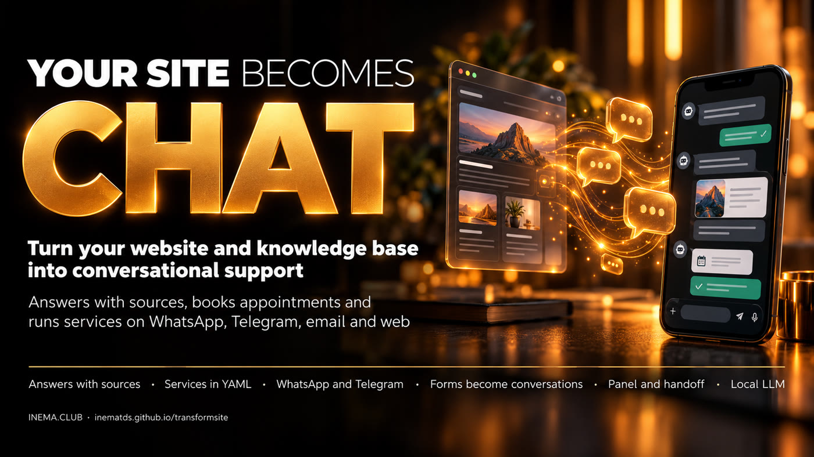

# transformsite

[](https://inematds.github.io/transformsite/guia/en/)

**🇧🇷 [Português](README.md) · 🇺🇸 [English](README.en.md) · 🇪🇸 [Español](README.es.md)**

**Turn your site and your knowledge base into a chat support agent.**
The site becomes the source of truth; the customer talks via **WhatsApp, Telegram, email or a widget on the site**.
The agent **answers citing the source** (or says "I don't know" and hands over to the team) and **runs services**
(scheduling, contact us, duplicate copy…) collecting the data through conversation instead of forms.

## 📖 User guide

Full guide (landing + step by step): **https://inematds.github.io/transformsite/guia/en/** · 🗺️ [Roadmap](ROADMAP.md) (in Portuguese)

> Inspiration: **America.gov** (2026) brought the content of ~29 thousand US government sites into a single
> conversational entry point — first questions with sources, then transactions. transformsite is the open,
> simple version of that idea for any company, school or agency.

## How it works

```
site + docs ──ingest──► index (BM25 + vectors) ──► RAG with citations ─┐
legacy forms ──convert──► services/*.yaml ──► slot machine ─────────────┼──► Telegram · WhatsApp · email · widget
                              tools (calendar, tickets, POST to legacy, webhook) ┘
                              human handoff + admin panel + metrics
```

- **Everything local by default**: LLM on [Ollama](https://ollama.com) (or vLLM/LM Studio), `bge-m3` embeddings,
  index in a single SQLite file. It also works with **Claude Code** (`claude -p`) or **Codex CLI**
  (`codex exec`) via your subscription — no API key.
- **Service = one YAML file.** No code per service: slots with validated types (CPF, email, phone,
  postal code, date/time in Portuguese…), confirmation, idempotency, handoff.
- **The legacy system stays alive**: the converter generates services that make the same POST the old form made.
- **Privacy (LGPD)**: PII masked in logs, configurable retention, `privacy forget`, OTP before sensitive data.

## Quick install (5 minutes)

```bash
pipx install git+https://github.com/inematds/transformsite      # or: pip install .
ollama pull qwen3.6:35b-a3b && ollama pull bge-m3                # any instruct model works (e.g. qwen2.5:7b)

transformsite init meubot --org "Minha Empresa" --url https://www.minhaempresa.com.br --contact atendimento@minhaempresa.com.br
cd meubot
transformsite inventory          # Phase 0: site pages and forms → inventario/*.csv
transformsite ingest             # Phase 1: reads the whole site + docs/ → kb/index.sqlite
transformsite chat               # chat in the terminal
transformsite serve              # widget at /chat, dashboard at /admin, configured channels
```

No GPU? Use a smaller model (`qwen2.5:7b`, `llama3.1:8b`) or `llm.provider: claude_cli` / `codex_cli` (experimental: they run without errors but, in the pilot, still answered "I don't know" where Ollama gets it right — under investigation).

## Commands

| Command | What it does |
|---|---|
| `init <folder>` | creates the project (config, 2 example services, test scenarios) |
| `inventory` | crawls the site and lists pages and forms with a suggested priority |
| `ingest` | crawler (sitemap + links, respects robots.txt) + local docs → hybrid index; incremental re-ingestion by hash |
| `ask "question"` / `chat` | test in the terminal |
| `golden` | generates a draft of test questions from the knowledge base (to review) |
| `eval` | measures: valid citation, "I don't know" out of scope, injection blocked, latency; runs conversation scenarios |
| `validate` | validates `services/*.yaml` (schema + rules: confirmation, idempotency, existing tools) |
| `convert form.html\|form.pdf\|URL` | legacy form → `service.yaml` with `review: pending` |
| `serve` | server: web widget, webhooks (WhatsApp/Telegram), pollers (Telegram/IMAP), dashboard |
| `report --since 7` | metrics (resolution without a human, handoff, time to completion, abandonment per slot) in JSON/CSV |
| `privacy forget --user canal:id` / `privacy purge` | LGPD: delete a user / purge by retention |

## A service

```yaml
service: agendar
review: approved            # converted services are born "pending" and only go live after approval
intent:
  description: "Agendar um atendimento"
  examples: ["quero agendar", "marcar horário"]
slots:
  - {name: nome, type: text, prompt: "Qual é o seu nome?"}
  - {name: email, type: email, prompt: "Qual e-mail para o convite?"}
  - name: data_hora
    type: datetime
    prompt: "Qual dia e horário prefere?"
    options_from: tool:agenda.slots_livres          # offers free slots as buttons
    constraints: {validate_tool: agenda.validar_horario}
confirm: {template: "Confirmo {nome} em {data_hora|fmt_br}?"}
action:
  tool: agenda.criar_evento
  args: {title: "Atendimento – {nome}", start: "{data_hora}", email: "{email}"}
  idempotency_key: "{session_id}:{data_hora}"
on_success: {reply: "Agendado! Protocolo {result.id}."}
```

The customer can answer everything at once ("I'm Ana, ana@x.com, Thursday at 10"), correct themselves ("no, the email
is…"), ask something midway (the bot answers with a source and returns to the request), cancel or come back days later.

Custom tools: create `tools/minha.py` with `register(registry)` — see `tools/exemplo.py`.

## Channels

| Channel | How to enable |
|---|---|
| Web widget | on by default: `<script src="https://SEU_DOMINIO/widget.js"></script>` |
| Telegram | `TELEGRAM_BOT_TOKEN` in `.env` (create the bot at @BotFather) |
| WhatsApp (Evolution API, self-hosted) | `channels.whatsapp` + `EVOLUTION_API_KEY`; webhook `POST /webhook/whatsapp` |
| WhatsApp (official Cloud API) | `channels.whatsapp_cloud` (`phone_number_id`, `token_env`, `verify_token`); webhook `/webhook/whatsapp-cloud` |
| Email | `channels.email.enabled: true` + IMAP/SMTP |

Human handoff: `handoff.targets` (`panel`, `email:...`, `telegram:<chat_id>`). In the dashboard, an agent
**takes over** the conversation (the bot goes silent) and **hands it back** when done (the bot resumes where it left off).

## Deploy on a VPS

```bash
curl -fsSL https://raw.githubusercontent.com/inematds/transformsite/main/deploy/vps/install.sh | sudo bash -s -- \
  --domain bot.suaempresa.com.br --site https://www.suaempresa.com.br --org "Sua Empresa" --contact atendimento@suaempresa.com.br --whatsapp
```

Comes up with Docker Compose: **app + Ollama + Evolution API (WhatsApp) + Caddy (automatic HTTPS)**. Details in
[`deploy/vps/README.md`](deploy/vps/README.md) (in Portuguese).

## Pilot: INEMA.CLUB

The [`pilot/`](pilot/) folder is the real project used to validate the framework with the site
[inema.club](https://www.inema.club): 386 pages → 1,512 chunks; with 73 test questions and a local LLM,
**92.6%** of answers with a valid source, **100%** "I don't know" out of scope, **100%** injection
blocked, p95 of 2.6 s; **13/13** conversation scripts. Details in [`pilot/RESULTADOS.md`](pilot/RESULTADOS.md) (in Portuguese).

## Development

```bash
uv venv && uv pip install -e '.[dev]'
pytest -q                       # no network, deterministic fake LLM
```

MIT License · made by [INEMA](https://www.inema.club) — open and free content.
